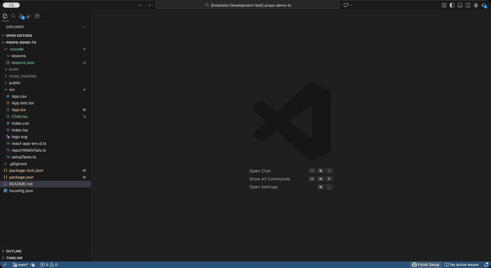
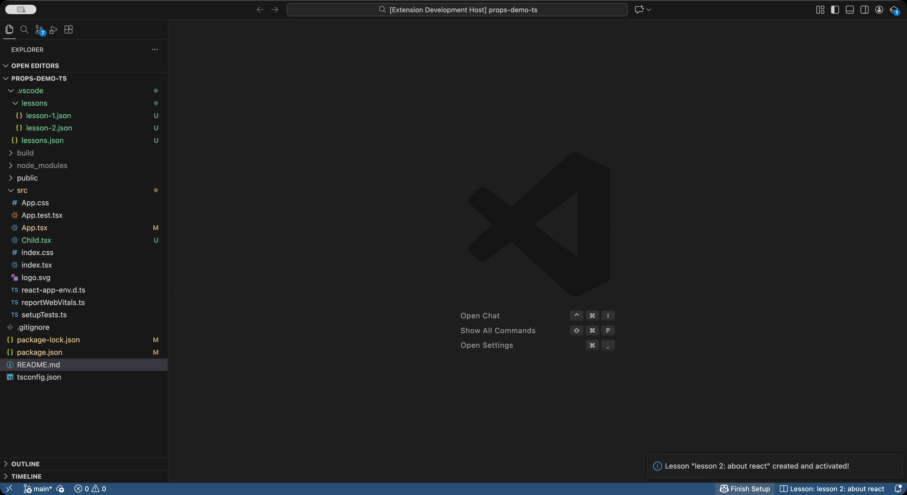

# Code Highlight for Lectures

> Perfect tool for programming instructors and code reviewers! Highlight code sections and add Markdown annotations during live coding lectures, tutorials, and demos. Create step-by-step lesson guides to explain codebases to other developers. Organize notes by lessons, review them with keyboard navigation, and keep your audience engaged - all without modifying source code.

[](https://marketplace.visualstudio.com/items?itemName=academeez.academeez-code-highlight) [](LICENSE)

---

## 🎯 About

**Code Highlight for Lectures** is a VS Code extension designed for programming instructors, code reviewers, and developers who want to create educational content about codebases. It helps you create more engaging educational experiences and step-by-step guides by allowing you to:

- **Highlight code sections** with visual decorations that focus your audience's attention
- **Add contextual Markdown annotations** without modifying your source code
- **Organize notes by lessons** for structured teaching sessions and codebase guides
- **Review notes with keyboard navigation** for smooth presentations

Perfect for:

- **Educators** who want to explain complex logic, draw attention to key concepts, or provide additional context during live coding demonstrations
- **Code reviewers** and **senior developers** creating step-by-step instruction guides to help other developers understand a codebase, walk through architecture, or explain implementation details

---

## 📦 Installation

### From VS Code Marketplace

1. Open VS Code
2. Go to the Extensions view (`Ctrl+Shift+X` / `Cmd+Shift+X`)
3. Search for **"Code Highlight for Lectures"**
4. Click **Install**
5. Reload VS Code when prompted

### From Command Line

```bash
code --install-extension academeez.academeez-code-highlight
```

---

## 🚀 Quick Start

1. **Create a lesson** to organize your notes:

   - Press `Ctrl+Shift+P` (or `Cmd+Shift+P` on Mac)
   - Type "Create New Lesson"
   - Enter a lesson title (e.g., "Introduction to React Hooks")

2. **Highlight code and add notes**:

   - Select code in any file
   - Press `Ctrl+Alt+L` (or `Cmd+Alt+L` on Mac)
   - Write your Markdown notes in the side panel
   - Click **Save**

3. **Review your notes**:
   - Press `Ctrl+Shift+P`
   - Type "Review Lecture Notes"
   - Use arrow keys to navigate between notes

---

## ✨ Features

### 🎓 Lesson Management

Organize your lecture notes into lessons. Each lesson can contain multiple notes, making it easy to structure your teaching sessions.

**Commands:**

- **Create New Lesson** - Start a new lesson
- **Set Active Lesson** - Switch between lessons
- **Delete Lesson** - Remove a lesson

<!-- GIF: Create new lesson - showing the command palette with "Create New Lesson", entering a lesson title, and seeing it appear in status bar -->



<!-- GIF: Set active lesson - showing quick pick to select a lesson and seeing the status bar update -->



---

### 💡 Code Highlighting & Annotation

Highlight specific code sections and attach Markdown explanations without modifying your source code.

**How to use:**

1. Select the code you want to highlight
2. Press `Ctrl+Alt+L` (or `Cmd+Alt+L`)
3. A side panel opens where you can write Markdown notes
4. Click **Save** to add the note to your active lesson

**Features:**

- Multiple code ranges per note
- Add/remove ranges dynamically
- Visual highlighting with blue decorations
- Dim other code for focus
- File explorer indicators for highlighted files

<!-- GIF: Highlight code - showing code selection, pressing Ctrl+Alt+L, panel opening, writing markdown, adding another range, and saving -->


---

### 📝 General Notes

Add general notes that don't reference specific code - perfect for introducing concepts, providing context, or explaining theory.

**How to use:**

1. Press `Ctrl+Alt+L` without selecting any code
2. The panel opens for general notes
3. Write your Markdown content
4. Save to add to your lesson

---

### 🔍 Notes Review Mode

Review all your lecture notes in order with smooth keyboard navigation. Navigate through notes while viewing the highlighted code and Markdown preview side-by-side.

**How to use:**

1. Press `Ctrl+Shift+P`
2. Type "Review Lecture Notes"
3. Use **Arrow Keys** to navigate:
   - **→ (Right Arrow)**: Next note
   - **← (Left Arrow)**: Previous note
   - **Esc**: Exit review mode

**Features:**

- Automatic code highlighting as you navigate
- Markdown preview for each note
- Smooth navigation through notes in order
- Focus management for keyboard-only control

<!-- GIF: Review mode - showing starting review, arrow keys navigating through notes, code highlighting updating, markdown preview updating -->


---

### ⌨️ Keyboard Shortcuts

| Action                      | Shortcut                   |
| --------------------------- | -------------------------- |
| Add Lecture Notes           | `Ctrl+Alt+L` / `Cmd+Alt+L` |
| Next Note (Review Mode)     | `→` (Right Arrow)          |
| Previous Note (Review Mode) | `←` (Left Arrow)           |
| Exit Review Mode            | `Esc`                      |

**Note:** Review mode shortcuts only work when the markdown preview is focused.

---

## 📚 Usage Examples

### Example 1: Teaching a React Component

1. Create a lesson: "React Components Basics"
2. Select the component code
3. Press `Ctrl+Alt+L`
4. Add notes explaining:
   - Component structure
   - Props usage
   - State management

### Example 2: Code Review Session

1. Create a lesson: "Code Review - Pull Request #123"
2. Highlight different sections of code
3. Add annotations explaining:
   - Potential issues
   - Suggested improvements
   - Best practices

### Example 3: Step-by-Step Tutorial

1. Create a lesson for each step of your tutorial
2. Highlight code at each step
3. Add explanations for each concept
4. Review mode allows smooth progression through steps

### Example 4: Codebase Instruction Guide

1. Create lessons like "Architecture Overview", "Database Layer", "API Endpoints"
2. Highlight key files and code sections
3. Add detailed explanations for each part of the codebase
4. Create a sequential guide that other developers can follow to understand the repository
5. Share the `.vscode/lessons.json` file with your team - they can review the guide using review mode

---

## 🛠️ Commands

Access all commands via the Command Palette (`Ctrl+Shift+P` / `Cmd+Shift+P`):

| Command                                | Description                                 |
| -------------------------------------- | ------------------------------------------- |
| `Code Highlight: Add Lecture Notes`    | Open panel to add notes for selected code   |
| `Code Highlight: Review Lecture Notes` | Start review mode to navigate through notes |
| `Code Highlight: Create New Lesson`    | Create a new lesson                         |
| `Code Highlight: Set Active Lesson`    | Switch the active lesson                    |
| `Code Highlight: Delete Lesson`        | Delete a lesson                             |

---

## 📁 File Structure

Your lecture notes are stored in:

```
.vscode/
├── lessons.json           # Master file tracking all lessons
└── lessons/
    ├── lesson-1.json     # Individual lesson files
    ├── lesson-2.json
    └── ...
```

**Note:** These files are stored in your workspace `.vscode` folder and are safe to commit to version control.

---

## 🎨 Features Overview

- ✅ **Non-intrusive**: Never modifies your source code
- ✅ **Markdown support**: Rich formatting for your notes
- ✅ **Lesson organization**: Structure notes by teaching sessions
- ✅ **Keyboard navigation**: Smooth review experience
- ✅ **Visual highlighting**: Focus attention on specific code
- ✅ **Multiple ranges**: Highlight non-adjacent code sections
- ✅ **File indicators**: See which files have notes in explorer

---

## 🐛 Troubleshooting

### No active lesson error

**Solution:** Create a new lesson or set an active lesson using the Command Palette.

### Notes panel not opening

**Solution:** Make sure you have a file open in the editor.

### Review mode not working

**Solution:** Ensure you're in review mode (Command Palette → "Review Lecture Notes") and the markdown preview panel is focused.

### Keyboard shortcuts not working in review mode

**Solution:** Click on the markdown preview panel to ensure it has focus, then use arrow keys.

---

## 📝 Requirements

- VS Code version 1.107.0 or higher

---

## 🤝 Contributing

Contributions are welcome! This is an open source project from Academeez.

1. Fork the repository
2. Create a feature branch
3. Make your changes
4. Submit a pull request

---

## 📄 License

This extension is licensed under the [MIT License](LICENSE).

---

## 🙏 Acknowledgments

Built by [Academeez](https://github.com/ywarezk/academeez) - an open source education platform for coders where professional developers publish advanced content including articles, videos, and live code editors.

---

## 📮 Support & Feedback

- 🐛 [Report Issues](https://github.com/ywarezk/vscode-code-highlight/issues)
- 💡 [Request Features](https://github.com/ywarezk/vscode-code-highlight/issues)
- ⭐ [Rate the Extension](https://marketplace.visualstudio.com/items?itemName=academeez.academeez-code-highlight&ssr=false#review-details)

---

**Made with ❤️ for programming instructors**
